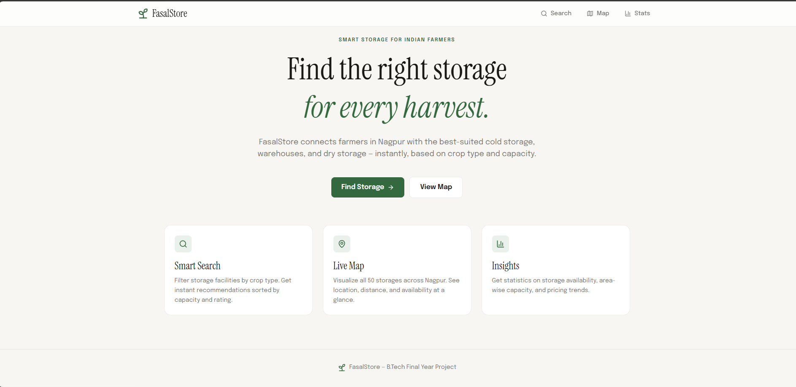
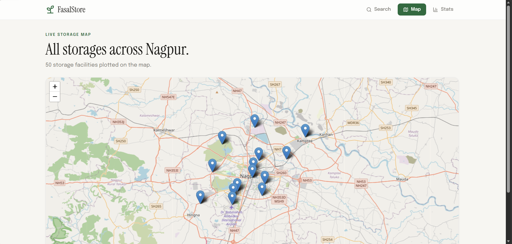
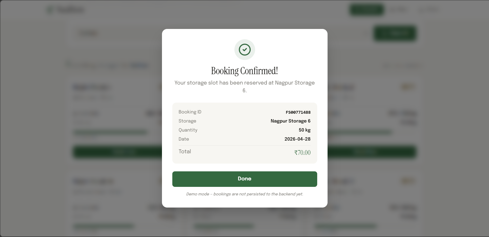

# 🌾 FasalStore — Smart Crop Storage Recommendation System

A full-stack web application that helps farmers in **Nagpur** find the most suitable storage facilities for their crops — based on crop type, capacity, distance, price, and availability.

> **B.Tech Final Year Project** · Built with Flask + React + Tailwind

---

## 📸 Screenshots

| Landing Page | Search Results |
|:---:|:---:|
|  |  |

| Live Map View | Marker Popup |
|:---:|:---:|
|  |  |

| Insights Dashboard | Booking Modal |
|:---:|:---:|
|  |  |

| Booking Confirmation |
|:---:|
|  |

---

## ✨ Features

### Core Features (Fully Implemented)

- 🔍 **Smart Search** — Filter storage facilities by crop type. Returns results sorted by capacity, with availability percentages and ratings.
- 🗺️ **Interactive Map** — Visualize all 50 storage facilities across Nagpur on a real OpenStreetMap. Click any marker to see storage details.
- 📊 **Insights Dashboard** — Aggregated network analytics: total capacity, average pricing, occupancy rates, crop distribution, and top areas by capacity.
- 🎨 **Premium UI** — Custom design system with serif typography (Instrument Serif), warm earthy palette, and consistent visual language across all pages.
- 📱 **Responsive** — Works on desktop and tablet screens.

### UI Demo (Frontend-Only)

- 📦 **Booking Modal** — Visual booking flow with quantity, date, and live price calculation. Backend persistence is in [Future Scope](#-future-scope).

---

## 🛠️ Tech Stack

### Frontend
| Tool | Purpose |
|---|---|
| **React 19** (with Vite) | UI library + lightning-fast dev server |
| **Tailwind CSS 4** | Utility-first styling, custom design tokens |
| **React Router** | Client-side routing for SPA navigation |
| **Axios** | HTTP client for backend communication |
| **React Leaflet** | Interactive maps with OpenStreetMap tiles |
| **Lucide React** | Modern icon library |

### Backend
| Tool | Purpose |
|---|---|
| **Python 3.11** | Backend runtime |
| **Flask 3.1** | REST API framework |
| **Flask-CORS** | Cross-origin request support for the frontend |
| **JSON file storage** | Lightweight data persistence (50 storage records) |

---

## 🏗️ Architecture
┌──────────────────┐         HTTP / JSON          ┌──────────────────┐
│                  │  ◄──────────────────────►   │                  │
│   React (Vite)   │                              │   Flask (Python) │
│   localhost:5173 │                              │  127.0.0.1:5000  │
│                  │                              │                  │
└──────────────────┘                              └──────────────────┘
│
▼
storage_data.json
(50 storage records)

---

## 📁 Project Structure
fasalstore/
├── backend/
│   ├── data/
│   │   └── storage_data.json      # 50 storage records (Nagpur)
│   ├── app.py                     # Flask app + 3 REST endpoints
│   └── requirements.txt           # Python dependencies
│
├── frontend/
│   ├── public/                    # Static assets
│   ├── src/
│   │   ├── components/
│   │   │   ├── Navbar.jsx         # Sticky frosted-glass navigation
│   │   │   └── BookingModal.jsx   # Reservation modal (UI demo)
│   │   ├── pages/
│   │   │   ├── Landing.jsx        # Hero + feature cards
│   │   │   ├── Search.jsx         # Crop filter + storage cards
│   │   │   ├── Map.jsx            # Leaflet map with markers
│   │   │   └── Analytics.jsx      # Aggregated insights
│   │   ├── api.js                 # Axios wrapper for backend calls
│   │   ├── App.jsx                # Router setup
│   │   ├── index.css              # Tailwind + design tokens
│   │   └── main.jsx               # React entry point
│   ├── index.html
│   ├── package.json               # Frontend dependencies
│   └── vite.config.js             # Vite + Tailwind plugin
│
├── Screenshots/                   # README screenshots
└── README.md                      # You are here

---

## 🚀 Getting Started

### Prerequisites

- **Python 3.11+** ([download](https://www.python.org/downloads/))
- **Node.js 20+** + npm ([download](https://nodejs.org/))

### 1. Clone / Download the Project

Place the `fasalstore/` folder anywhere on your machine.

### 2. Run the Backend

```bash
cd fasalstore/backend

# Create a virtual environment (recommended)
python -m venv .venv

# Activate it
# On Windows:
.venv\Scripts\activate
# On Mac/Linux:
source .venv/bin/activate

# Install dependencies
pip install -r requirements.txt

# Start the Flask server
python app.py
```

Backend runs on `http://127.0.0.1:5000`

### 3. Run the Frontend

In a **new terminal**:

```bash
cd fasalstore/frontend

# Install dependencies
npm install

# Start the dev server
npm run dev
```

Frontend runs on `http://localhost:5173`

Open your browser to `http://localhost:5173` and you should see the Landing page. 🌾

---

## 📡 API Reference

### Base URL
`http://127.0.0.1:5000`

### `GET /`
Health check endpoint.

**Response (text/html):**
FasalStore Backend Running 🚀

---

### `GET /storages`
Returns all storage facilities along with metadata.

**Response (application/json):**
```json
{
  "success": true,
  "total": 50,
  "crops": ["cotton", "fruits", "orange", "rice", "soybean", "vegetables", "wheat"],
  "areas": ["Butibori", "Hingna", "Jaripatka", "..."],
  "data": [
    {
      "id": 1,
      "name": "Nagpur Storage 1",
      "area": "Sitabuldi",
      "crop": "orange",
      "distance": 4,
      "price": 2.3,
      "capacity": 600,
      "available": 320,
      "rating": 4.5,
      "lat": 21.1458,
      "lng": 79.0882
    }
  ]
}
```

**Used by:** Map view, Insights dashboard, Search dropdown.

---

### `POST /recommend`
Returns storages matching a specific crop, sorted by capacity (high to low).

**Request body (application/json):**
```json
{
  "crop": "orange"
}
```

**Response (application/json):**
```json
{
  "success": true,
  "count": 11,
  "data": [
    { "id": 20, "name": "Nagpur Storage 20", ... },
    { "id": 5, "name": "Nagpur Storage 5", ... }
  ]
}
```

**Used by:** Search page.

---

## 🎨 Design System

| Token | Value | Use Case |
|---|---|---|
| `fasal-bg` | `#f7f6f2` | Main background (warm off-white) |
| `fasal-surface` | `#ffffff` | Cards, modals |
| `fasal-text` | `#1a1916` | Primary text |
| `fasal-muted` | `#7a7770` | Secondary text |
| `fasal-accent` | `#1a6b3c` | Primary CTA, links (deep forest green) |
| `fasal-gold` | `#9a6f0a` | Ratings, premium accents |
| `fasal-blue` | `#1a4a8c` | Tertiary highlights |
| `fasal-warn` | `#c4520a` | Warnings, errors |

**Typography:**
- **Body:** Epilogue (Google Fonts)
- **Headings + Prices:** Instrument Serif (Google Fonts)

---

## 🔮 Future Scope

The current build focuses on discovery + insights. The following features are planned for future iterations:

- 🔐 **Authentication** — Farmer accounts, storage owner accounts (separate dashboards)
- 💾 **Booking persistence** — Wire the booking modal to a real `POST /bookings` endpoint backed by a database (PostgreSQL or MongoDB)
- 💳 **Payment integration** — Razorpay / Stripe for reservation deposits
- 🚚 **Refrigerated truck booking** — Connect farmers with cold-chain logistics
- 📍 **Live truck tracking** — GPS simulation with timeline UI
- 🤖 **ML recommendations** — Predict best storage based on harvest patterns, weather, market prices
- 📱 **Mobile app** — React Native version for on-the-go farmers
- 🌐 **Multi-language** — Hindi + Marathi support for Nagpur farmers
- ⭐ **Reviews & ratings** — Farmer-submitted ratings instead of static numbers
- 🗓️ **Availability calendar** — Real-time slot booking with conflict prevention

---

## 👨‍🎓 Author

**Owais** — B.Tech Final Year

Built as part of the Final Year Project submission.

---

## 📜 License

Educational project. Free to learn from and adapt.